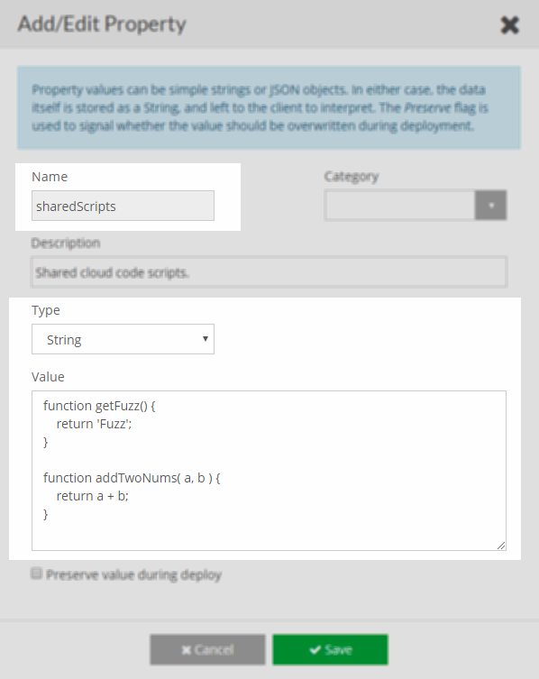

# SharedScripts
## Purpose
Script shows how you can use brainCloud properties to share scripts between cloud code.


## Script
Click [TestSharedFunctions.cloudcode.js](TestSharedFunctions.cloudcode.js) to download the file.

## Usage / Setup
To configure this script, simply import it into your app.

Then, you must add a Global Property with the scripts you want to share.

Properties can be set on the **Design | Custom Config | [Global Properties](https://portal.braincloudservers.com/admin/dashboard#/development/global-properties)** page.

The test script assumes a `getFuzz` and `addTwoNums` functions exist.
```
function getFuzz() {
    return 'Fuzz';
}

function addTwoNums( a, b ) {
    return a + b;
}
```





The script is expected to be called when a player is completing the match.

You call the script in the app via the [RunScript()](https://getbraincloud.com/apidocs/apiref/index.html#capi-script-runscript) API call.

The script takes the following parameters:

* ownerId – Owner id of the match played.
* matchId – Id of the match played.
* winnerId – Id of the winning player.
* loserId – Id of the losing player.
* winnerRating – Rating of the winning player.
* loserRating – Rating of the losing player.
* isTie – Whether the match state ended in a tie

Example parameters JSON

```json
{
   "ownerId": "8f6b8fc3-cb19-4052-9bf6-ebf86a628536",
   "matchId": "a4b36631-a35c-4e2c-af8b-4c671c265b91",
   "winnerId": "8f6b8fc3-cb19-4052-9bf6-ebf86a628536",
   "loserId": "10627e1e-208f-4fb8-93a0-ca4ac014acef",
   "winnerRating": 1200,
   "loserRating": 1200,
   "isTie" : false
}
```